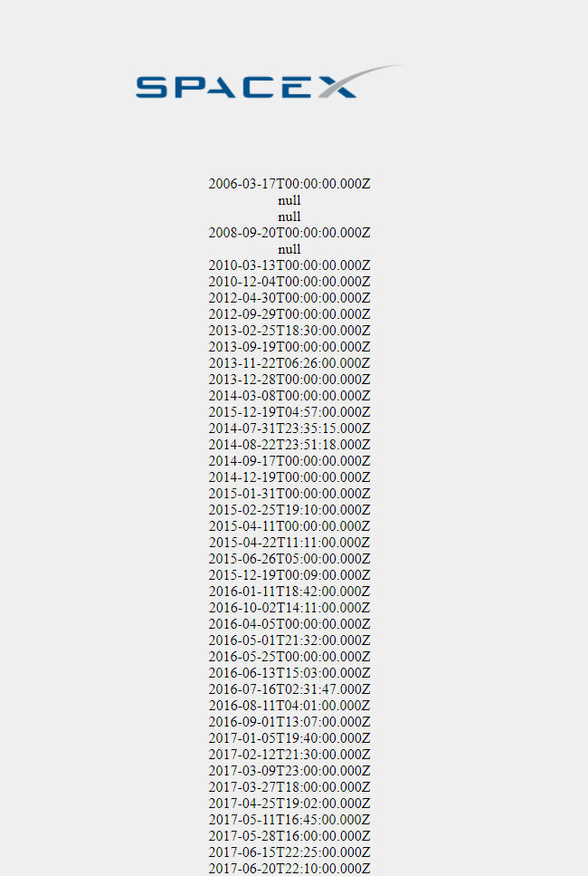
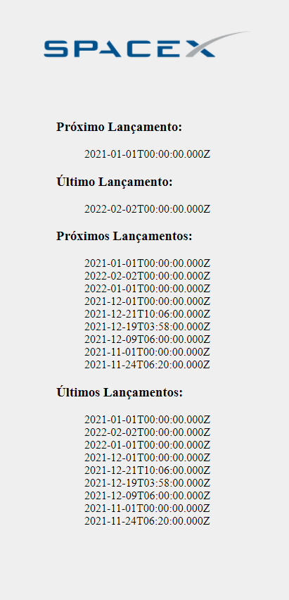

## Consumir API

### API

Criar uma API

Abra seu VSCode e crie uma pasta para o seu projeto (utilizei o nome **consuming_spaceX**. Dentro dela inicialize o projeto colocando os seguintes comandos em seu terminal: 

```jsx
npm init -y
```

Instalando as dependências:

```jsx
npm install express nodemon cors axios
```

- **npm** → node package manage
- **install** → para instalar
- **express** → framework Node
- **nodemon** → reiniciar automaticamente o servidor após as atualizações
- **cors** → permitir o acesso do frontend com a API
- **axios** → cliente HTTP baseado em Promises para fazer requisições

Chamando o **express**:

- Crie um arquivo chamado **server.js** dentro da pasta principal do projeto:

```jsx
const express = require('express')
const app = express()

app.get('/', (req, res) => {
	return res.json({ message: 'Olá mundo!'})
})

app.listen('4567')
```

### Frontend

Consumir API

Crie um arquivo **index.html**:

```jsx
<!DOCTYPE html>
<html lang="en">
<head>
	<meta charset="UTF-8">
	<meta http-equiv="X-UA-Compatible" content="IE=edge">
	<meta name="viewport" content="width=device-width, initial-scale=1.0">
	<title>SpaceX Launches</title>
</head>
<body>
	<script>
		async function getContent(){
			try {
				const response = await fetch('http://localhost:4567')
				console.log('testando o servidor)
			} catch (error) {
				console.error(error)
			}
		}
		getContent()
	</script>
</body>
</html>
```

Perceba que eu criei uma função **assíncrona** que esperará até receber a API e salvará o conteúdo dentro de **response**.

Perceba também o **console.log('testando o servidor')** que coloquei para usar o **npx lite-server**. Esse comando quando digitado no terminal permite à aplicação atualizar automaticamente a cada alteração feita em seu arquivo html.

Para permitir que nossa aplicação acesse o backend e use nossa API iremos utilizar o **CORS**. Para isso no arquivo **server.js** adicionamos o **CORS** para permitir o acesso à API:

```jsx
const cors = require('cors')
const express = require('express')
const app = express()

app.use(cors())

app.get('/', (req, res) => {
	return res.json([
		{ name: 'Rodrigo'},
		{ name: 'Rogério'},
	])
})

app.listen('4567')
```

Perceba que fiz uma alteração no arquivo **server.js** e adicionei objetos com a propriedade **name**. 

Voltando ao arquivo html, vamos utilizar a resposta da nossa **API** e trabalhar com ela.

```jsx
<!DOCTYPE html>
<html lang="en">
<head>
	<meta charset="UTF-8">
	<meta http-equiv="X-UA-Compatible" content="IE=edge">
	<meta name="viewport" content="width=device-width, initial-scale=1.0">
	<title>SpaceX Launches</title>
	<style>
		body {
			text-align: center;
		}
		ul {
			list-style-type: none;
		}
	</style>
</head>
<body>
	
	<ul id="lista">

	</ul>
	<script>
		async function getContent(){
			try {
				const response = await fetch('http://localhost:4567/')
				const data = await response.json()
				show(data)
				console.log(data.length)
			} catch (error) {
				console.log(error)
			}
		}
		getContent()

		function show(users) {
			let output = ''

			for( let user of users ) {
				output += `<li>${user.date_utc}</li>`
			}

			document.getElementById('lista').innerHTML = output
		}

	</script>
</body>
</html>

```

### Backend
Pegando a URL com os dados de lançamentos: 
* https://api.spacexdata.com/v3/launches

AXIOS
Muito parecido com a ideia do fetch, utilizaremos o axios para receber o json da API de lançamentos.

```jsx
const cors = require('cors')
const express = require('express')
const app = express()
const axios = require('axios')

app.use(cors())

app.get('/', async(req, res) => {

	//do response (res) podemos extrair diretamente o data
	const { data } = await axios('https://api.spacexdata.com/v5/launches')

	return res.json(data)
})

app.listen('4567')
```
Ao executar o código acima (node server.js), podemos ver que na porta localhost:4567 temos nossa API rodando perfeitamente.



Agora podemos utilizar os dados e filtrar aquelas datas que realmente importa para a nossa aplicação. Com o código abaixo com o HTML, CSS e o JS.

```jsx
<!DOCTYPE html>
<html lang="en">
<head>
	<meta charset="UTF-8">
	<meta http-equiv="X-UA-Compatible" content="IE=edge">
	<meta name="viewport" content="width=device-width, initial-scale=1.0">
	<title>SpaceX Launches</title>
	<style>
		body {
			text-align: center;
			background-color: #efefef;
		}
		.datas {
			margin: 0 auto;
			width: 300px;
			text-align: left;
			padding-left: 20px;
			border: 1px solid black;

		}
		ul {
			list-style-type: none;
		}
	</style>
</head>
<body>
	
	<div class="datas">
	<h3>Próximo Lançamento: </h3>
	<ul id="nextLaunch"></ul>
	<h3>Último Lançamento:</h3>
	<ul id="lastLaunch"></ul>
	<h3>Próximos Lançamentos:</h3>
	<ul id="nextLaunches"></ul>
	<h3>Últimos Lançamentos: </h3>
	<ul id="lastLaunches"></ul>

	<ul id="lista">
	</ul>
	</div>
	<script>
		async function getContent(){
			try {
				const response = await fetch('http://localhost:4567/')
				const data = await response.json()
				//show(data)
				console.log(data[0])
				console.log(data.length)
				show1(data)
				show2(data)
				show3(data)
				show4(data)
			} catch (error) {
				console.log(error)
			}
		}
		getContent()


		function show1(users) {

			let output = ''

			output += `<li>${users[users.length-1].date_utc}</li>`

			document.getElementById('nextLaunch').innerHTML = output
		}
		function show2(users) {
			let output = ''

			output += `<li>${users[users.length-2].date_utc}</li>`

			document.getElementById('lastLaunch').innerHTML = output
		}
		function show3(users) {
			let output = ''

			for (let i = 1; i < 10; i++){
				output += `<li>${users[users.length-i].date_utc}</li>`
			}
			document.getElementById('nextLaunches').innerHTML = output
		}
		function show4(users) {
			console.log(users[0].date_utc)
			let output = ''

			for (let i = 1; i < 10; i++){
				output += `<li>${users[users.length-i].date_utc}</li>`
			}
			document.getElementById('lastLaunches').innerHTML = output
		}

		function show(users) {
			let output = ''

			for( let user of users ) {
				output += `<li>${user.static_fire_date_utc}</li>`
			}

			//document.getElementById('lista').innerHTML = output
		}

	</script>
</body>
</html>

```
E abaixo a imagem da nossa aplicação rodando.



